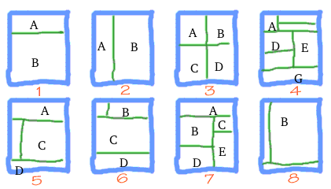

# BMCanvas-openDataStds
Business Model Canvas, a proposal of simple Open Data Standards

# Conventions of this standard proposal
Below, the standard.

## Popular models and standard models
... intro ...

File [BMCanvas-refModels.csv](./data/BMCanvas-refModels.csv) show the reference models and fix its labels, to distinguisg different Canvas strutures (or arrangement of concepts) and use in the other filenames.

## Modeling concepts representation
The concept list is not normalized, but expressed one set of concepts for each refModel-language. Anyway, the *element labels* are the commom for all descriptions, so, as in Wikipedia, we can expect a "concept consensus" between languages (in the *element* definition). All files with prefix "BMCanvasDef" are definitions.  Examples:

* [BMCanvasDef-std2009-ptBR.csv](./data/BMCanvasDef-lean2010-ptBR.csv), a Brazilian Portuguese Standard Canvas descrition.
* [BMCanvasDef-lean2010-ptBR.csv](./data/BMCanvasDef-lean2010-ptBR.csv),  a Brazilian Portuguese Lean Canvas descrition.
* ...

## Canvas structure representation
The proposal is restricted to the usual design solutions, and the "usual" theme variations. So, as pointed by Wikipedia and others, the reference model is the [Strategyzer.com canvas](https://commons.wikimedia.org/wiki/File:Business_Model_Canvas.png), that is a table with 9 cells. Any other "variant canvas structure" of this project must by expressed as a "table os cells".

There are two simple and open ways to express this kind of structure,

* a CSV with element labels and "empty cells with commands" like `#command` indicating "span to here the cell left" (`#span-left`), `#span-below`, etc.
* a simple JSON or XML structure mapping directally the structure.

The first mode is good for transform into HTML's `table` representation, the second for "guilhotine cells" (old deprecated HTML frames or modern HTML5+CSS set of `div`) representation. [Cases analysis](#) show that "fluid  `div`s" is the preferible form of HTML implementation, so, the second mode was elected.

...

